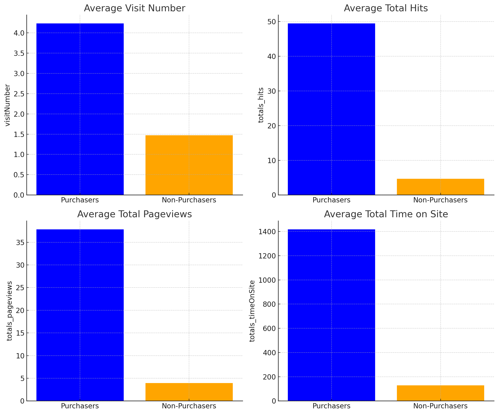

# GA - Predicting Customer Revenue to Maximize ROI
---
## Project Overview
In e-commerce, the 80/20 rule—where a small fraction of customers generates the majority of revenue—commonly holds true. However, in this case, the analysis shows an even starker reality: **99% of users do not make purchases**. This highlights the critical importance of optimizing marketing resources to focus on high-value customers.

This project aims to:
1. Identify potential buyers to narrow the target audience for marketing campaigns.
2. Predict revenue contributions from buyers to prioritize and optimize marketing spend.

---

## Key Insights
## Purchasers vs. Non-Purchasers
The stark disparity between purchasers and non-purchasers in e-commerce is visualized below, demonstrating the need for a focused strategy:

### Behavioral Differences
Purchasers display significantly different behaviours compared to non-purchasers. On average, they: 
- Visit the site more often.
- Interact with more pages.
- Spend substantially more time on the site.

---

## Methodology
1. Data Preparation:
     - Addressed class imbalance using SMOTE and class weighting.
     - Engineered features from customer behaviour and temporal data.

2. Stage 1: **Buyer Prediction (Classification)**
     - Model: Random Forest Classifier.
     - Objective: Accurately identify potential buyers.
     - Key Metrics:
         - ROC-AUC = 0.9792
         - Precision (Buyers) = 0.31
         - Recall (Buyers) = 0.69

3. Stage 2: **Revenue Prediction (Regression)**
    - Model: Random Forest Regressor.
    - Objective: Predict revenue for potential buyers to prioritize high-value customers.
    - Target Transformation: Applied $$\text{ln(revenue+1)}$$ to handle skewness and zero values.
    - Key Metrics:
         - RMSE = 10.7835
         - R² = 0.3419
--- 

## Why This Matters

1. **Optimized Marketing Spend**: By focusing on a narrow audience of high-value customers, marketing resources are utilized effectively.
2. **Improved ROI**: Predictive revenue estimates ensure targeted investments yield higher returns.
3. **Scalable Framework**: The methodology can be adapted to other e-commerce platforms for customer segmentation and revenue prediction.

--- 
## Results Dashboard

https://public.tableau.com/app/profile/paola.garay/viz/PredictingCustomerRevenuetoMaximizeROI/Dashboard1?publish=yes
