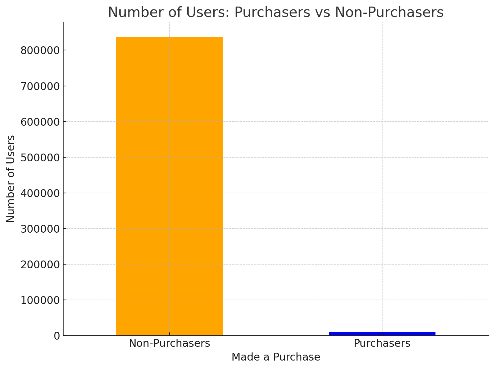

# Google Analytics - Predicting Customer Revenue to Maximize ROI
---
## Project Overview
In e-commerce, the 80/20 rule—where a small fraction of customers generates the majority of revenue—commonly holds true. However, in this case, the analysis shows an even starker reality: **99% of users do not make purchases**. This highlights the critical importance of optimizing marketing resources to focus on high-value customers.

This project aims to:
1. Identify potential buyers to narrow the target audience for marketing campaigns.
2. Predict revenue contributions from buyers to prioritize and optimize marketing spend.

---

## Key Insights
### Purchasers vs. Non-Purchasers

| **Description** | **Visualization** |
|------------------|--------------------|
| The stark disparity between purchasers and non-purchasers in e-commerce is visualized below, demonstrating the need for a focused strategy. |  |

---

## Methodology
1. Data Preparation:
     - Addressed class imbalance using oversampling and class weighting.

2. Stage 1: Buyer Prediction
     - Model: Random Forest Classifier.
     - Techniques: SMOTE, class weighting, and threshold tuning to balance recall (buyers) and precision.
     - Performance:
         - ROC-AUC = 0.9792
         - Precision (Buyers) = 0.31
         - Recall (Buyers) = 0.69
    Result: Identifies potential buyers, effectively narrowing the audience for targeted marketing.

3. Stage 2: Revenue Prediction
    - Dataset: Filtered predicted buyers from Stage 1 and included `log_transactionRevenue` as the target.
    - Target Transformation: Applied $$\text{ln(revenue+1)}$$ to address skewness, stabilize variance, and handle zero values.
    - Model: Random Forest Regressor.
    - Performance:
         - RMSE = 10.7835
         - R² = 0.3419
    Result: Estimates revenue for buyers, enabling prioritization of high-value customers.

--- 

## Impact

1. Optimized Marketing Spend: Focuses budgets on high-value customers.
2. Improved ROI: Guides investment toward customers with higher revenue potential.
3. Scalable Framework: Provides a reliable structure for customer segmentation and revenue prediction.

---
## Dashboadr
---

